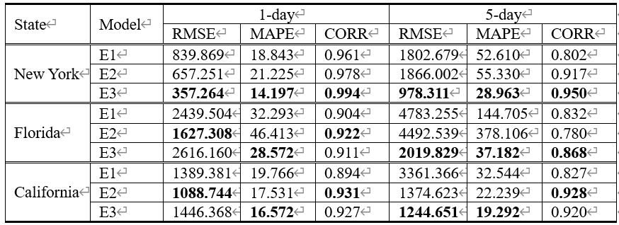

# US-COVID19-forecasting-using-temporal-and-spatial-data

## Motivation
- COVID-19 발생을 예측할 수 있다면, 효과적으로 예방할 수 있음.
- COVID-19는 사람을 통해 전파되기 때문에 공간적 요인에 영향을 받을 수 있으며, 또한 약 1-2주의 잠복기가 있기 때문에 시간적 요인도 고려해야함.

### Key idea
#### 1) 공간적 요소

COVID-19는 사람 간에 전파되기 때문에, 공간적인 요소에 영향을 받는다. 그림과 같이 미국의 특정 주의 COVID-19 확진 케이스는 인접한 주들의 COVID-19 확진 케이스에 영향을 받을 것이다.

#### 2) 시간적 요소

COVID-19는 감기와 증상이 유사하기 때문에, 증상을 느낀 사람들은 COVID-19 확진 판정을 받기 전에 자신의 증상을 웹에 검색하여 정보를 얻고자 할 가능성이 있다. 위 그림은 뉴욕 주에서 확진자 수와 'Throat irritation' 키워드의 구글 검색 비율, 그리고 해당 검색 비율을 19일 평행이동 시킨 것을 보여준다. 따라서 현재 시점의 'Throat irritation' 검색 비율은 19일 후의 COVID-19 확진자 수와 상관관계가 있을 가능성이 높다.

## Experiment
### Data
각 모델에서 사용한 데이터
- E1: 해당 주의 확진자 수 데이터
- E2: E1 + 인접 주들의 확진자 수 데이터
- E3: E2 + 시간 지연을 고려한 웹 데이터

### Result

	
	

좌측 그림은 특정 시점에서 1일 앞서 예측한 결과만 연결한 그래프이고, 우측 그림은 5일 앞서 예측한 결과만 연결한 그래프이다.

위 표는 1, 5일 예측일 때 각 모델들의 성능을 평가한 것이다. 뉴욕을 제외하고 플로리다, 캘리포니아에서 E2는 1-day 예측 정확도가 높았고 E3는 5-day 예측 정확도가 높았다.

## 진행 예정
- E2 모델의 단기간(1-day) 예측 정확성과 E3 모델의 장기간(5-day) 예측 정확성을 모두 갖는 모델을 설계한다.
- 더 많은 주를 대상으로 실험을 진행하고 결과를 확인한다.

