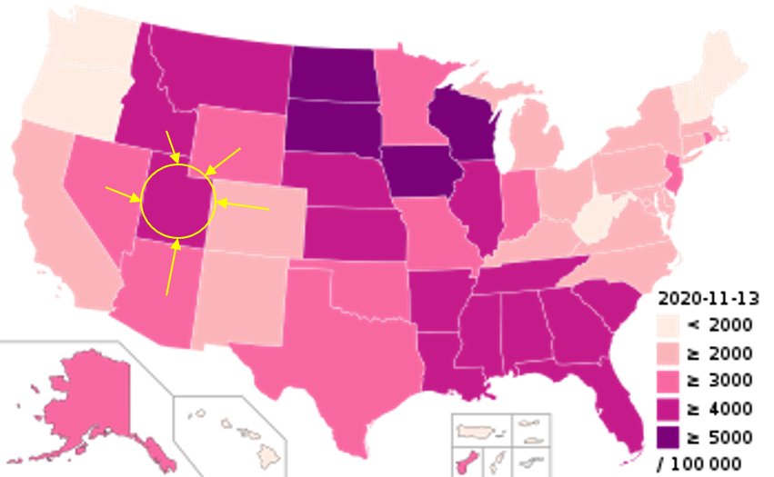
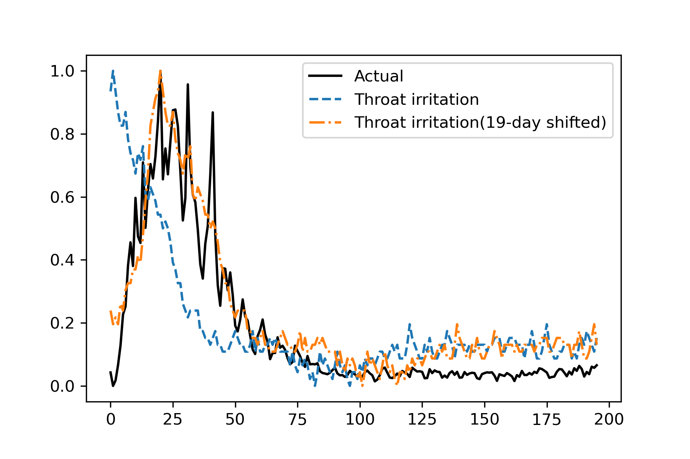
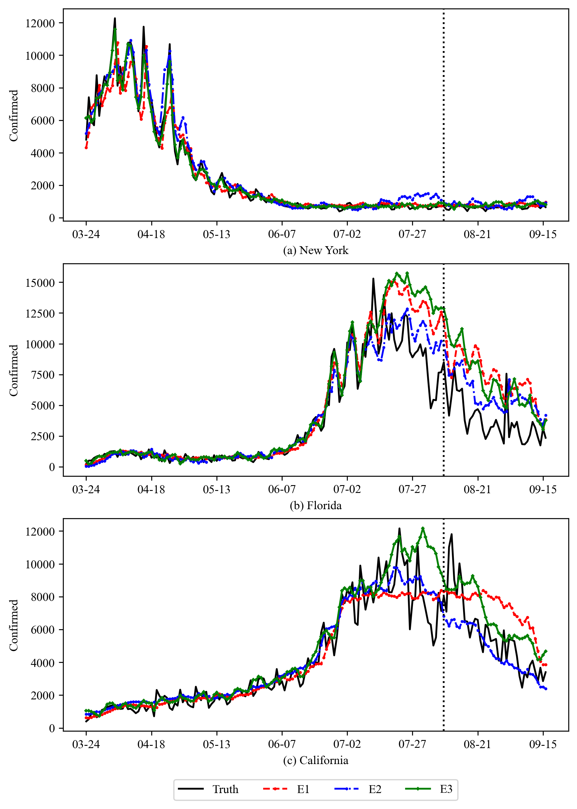
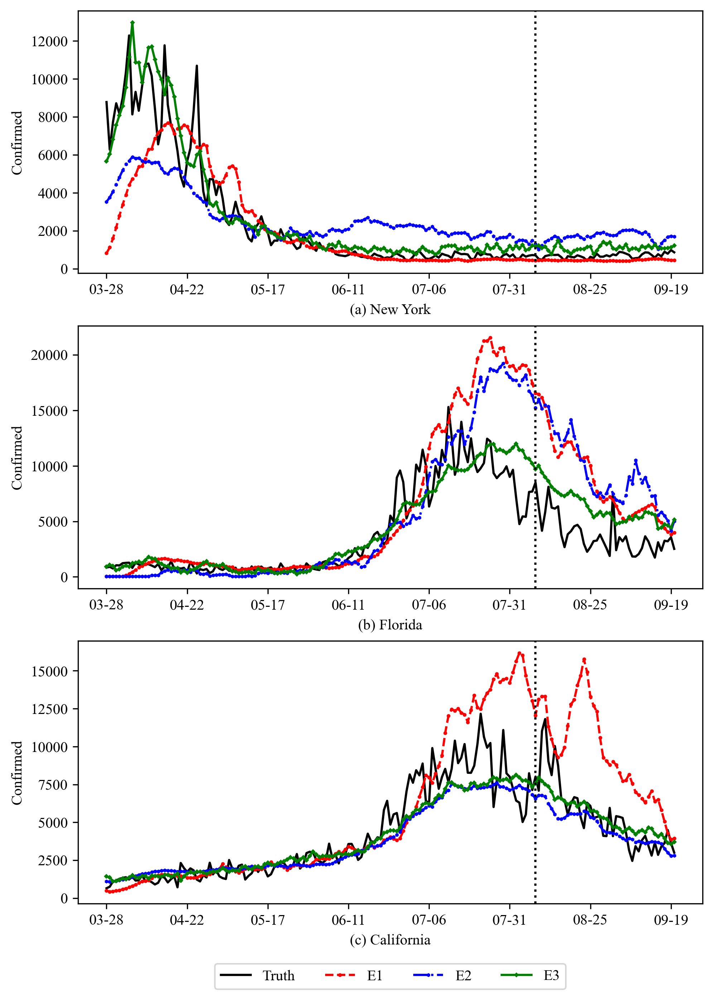

# US-COVID19-forecasting-using-temporal-and-spatial-data(진행중)

### Key idea
COVID-19의 발생은 크게 두 가지 요소에 의해 영향을 받는다.
1) 공간적 요소

COVID-19는 사람 간에 전파되기 때문에, 공간적인 요소에 영향을 받는다. 그림과 같이 미국의 특정 주의 COVID-19 확진 케이스는 인접한 주들의 COVID-19 확진 케이스에 영향을 받을 것이다.

2) 시간적 요소

COVID-19는 감기와 증상이 유사하기 때문에, 증상을 느낀 사람들은 COVID-19 확진 판정을 받기 전에 자신의 증상을 웹에 검색하여 정보를 얻고자 할 가능성이 있다. 위 그림은 뉴욕 주에서 확진자 수와 'Throat irritation' 키워드의 구글 검색 비율, 그리고 해당 검색 비율을 19일 평행이동 시킨 것을 보여준다. 따라서 현재 시점의 'Throat irritation' 검색 비율은 19일 후의 COVID-19 확진자 수와 상관관계가 있을 가능성이 높다.

### Result
E1: 해당 주의 확진자 수 데이터
E2: E1 + 인접 주들의 확진자 수 데이터
E3: E2 + 시간 지연을 고려한 웹 데이터

대부분의 경우, E2는 1-day 예측 정확도가 높았고 E3는 5-day 예측 정확도가 높았다.

위 그림은 1-day 예측 결과이다.

위 그림은 5-day 예측 결과이다.

### 진행 예정
E2 모델의 단기간(1-day) 예측 정확성과 E3 모델의 장기간(5-day) 예측 정확성을 모두 갖는 모델을 설계한다.

